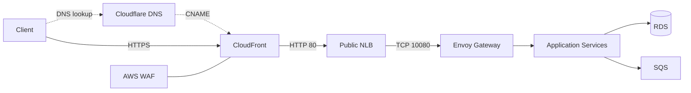

# Nexus Infrastructure

## Overview

Terraform infrastructure for the Nexus microservices platform on AWS. The
repository provisions shared resources and isolated development and production
environments running on Amazon EKS.

The platform includes:

- Multi-AZ VPC networking with public, private, and isolated database subnets.
- Amazon EKS with a managed system node group and Karpenter application nodes.
- CloudFront, AWS WAF, a public NLB, and Envoy Gateway for application traffic.
- PostgreSQL RDS, SQS, encrypted ECR repositories, and KMS.
- IAM roles and IRSA for platform controllers and application workloads.

## Architecture Diagram



Each environment spans two Availability Zones. NLB and NAT gateways use public
subnets, EKS nodes use private subnets, and RDS uses isolated database subnets.
Shared resources include the ACM certificate, ECR repositories, GitHub OIDC
provider, and application release role.

## Module Structure

```text
bootstrap/
  backend/          S3 Terraform state backend
  github-oidc/      GitHub Actions OIDC provider
shared/             Resources shared by all environments
envs/
  dev/              Development environment
  prod/             Production environment
modules/            Reusable Terraform modules
```

| Module | Responsibility |
| --- | --- |
| `acm` | Cloudflare DNS-validated ACM certificate |
| `cloudfront` | Public API CloudFront distribution |
| `ecr` | KMS-encrypted immutable container repositories |
| `eks` | EKS control plane, system node group, add-ons, and OIDC provider |
| `iam` | Platform and application IAM roles |
| `karpenter` | Controller, interruption handling, NodePool, and EC2NodeClass |
| `kms` | Customer-managed KMS keys and aliases |
| `network` | VPC, subnets, routing, NAT, security groups, and VPC endpoints |
| `nlb` | Public Network Load Balancer and Envoy target group |
| `rds` | PostgreSQL RDS, subnet group, monitoring, and secrets |
| `sqs` | Application queue and dead-letter queue |
| `waf` | CloudFront Web ACL and managed protections |

## Prerequisites

- Terraform >= 1.7
- AWS CLI with permission to provision the required resources
- kubectl and Helm
- A Cloudflare API token with `Zone: Read` and `DNS: Edit` permissions

Never commit credentials, Terraform state, plans, kubeconfigs, or local variable files.

## Getting Started

> Coming soon.
